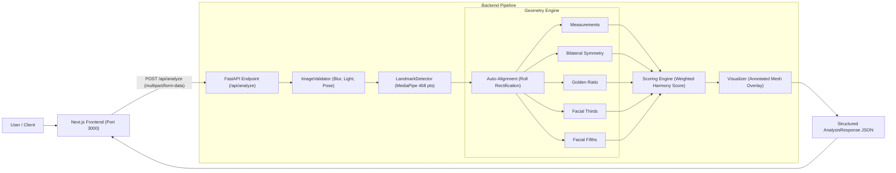

# Faceometry

### The Geometry Behind Your Face

**Analyze facial proportions, symmetry, and classical geometric ratios using computer vision and mathematics.**

Faceometry is a full-stack web application designed for facial geometric analysis. Upload a photo, and the backend detects dense 3D facial landmarks with MediaPipe, automatically rectifies head tilts, evaluates geometric proportions across multiple classical harmony models, and computes a **Facial Harmony Score** with transparent breakdown explanations and an annotated facial mesh overlay.

> [!IMPORTANT]
> Faceometry is a **geometric analysis tool**. It does **not** claim to objectively measure beauty, attractiveness, or human worth. Scores measure geometric alignment with classical aesthetic references (such as bilateral symmetry, facial thirds, facial fifths, and the Golden Ratio). These references are configurable and represent historical/artistic canons rather than universal standards.

---

## Table of Contents

- [Features](#features)
- [Tech Stack](#tech-stack)
- [Architecture](#architecture)
- [Project Structure](#project-structure)
- [Getting Started](#getting-started)
- [Configuration](#configuration)
- [API Reference](#api-reference)
- [How Scoring Works](#how-scoring-works)
- [Image Requirements & Preprocessing](#image-requirements--preprocessing)
- [Testing](#testing)
- [Docker](#docker)
- [Deployment](#deployment)
- [Privacy](#privacy)
- [Limitations](#limitations)
- [Roadmap](#roadmap)
- [License](#license)

---

## Features

- **Dense Landmark Detection**: 468+ facial landmarks extracted via MediaPipe Face Landmarker.
- **Intelligent Pose Tolerance & Auto-Alignment**:
  - Forgiving pose tolerances (up to ±35° roll, ±30° yaw, and ±25° pitch).
  - Automatic in-plane head tilt (roll) rectification: geometry calculations are computed on rotation-invariant upright coordinates, preventing natural camera angles from distorting scores.
- **Multi-Canon Geometric Analysis**:
  - **Bilateral Symmetry**: Measures mirrored landmark deviation across 6 anatomical regions (eyes, eyebrows, nose, mouth, jawline, cheeks) relative to the facial midline.
  - **Classical Proportions**: Evaluates facial aspect ratio, eye-to-face ratio, inter-eye spacing, nose aspect ratio, and mouth-to-nose ratio against centered reference ideals.
  - **Golden Ratio (φ ≈ 1.618)**: Analyzes key vertical and horizontal facial distances against the divine proportion.
  - **Facial Thirds**: Evaluates forehead, midface, and lower-face balance against the classical tripartite division.
  - **Facial Fifths**: Measures horizontal five-zone facial width distribution.
- **Dynamic Scoring Engine**:
  - Differentiated, continuous scoring curves that eliminate flat score plateaus and provide meaningful score variance across diverse face shapes.
  - Plain-language explanations for each component score.
- **Visual Landmark Mesh Overlay**: Returns a base64-encoded annotated image rendering landmarks and contours directly onto the user's photograph.
- **Modern, Responsive Frontend**: Next.js App Router with an animated aurora background, floating mesh canvas, stepped loading checklists, count-up score dials, and animated metric bars.
- **Privacy First**: All images are processed strictly in-memory and discarded immediately after computation; no photos are stored or retained.

---

## Tech Stack

| Layer | Technology | Description |
|-------|-----------|-------------|
| **Frontend** | Next.js 16 (App Router), React 19, TypeScript | High-performance, SSR/static web client |
| **Styling** | Tailwind CSS v4, Vanilla CSS tokens | Layered design system, glassmorphism, fluid typography |
| **Backend** | Python 3.10+, FastAPI, Pydantic v2 | High-throughput asynchronous REST API |
| **Computer Vision** | MediaPipe Face Landmarker, OpenCV (headless), Pillow | 3D landmark mesh extraction & visual annotation |
| **Math & Geometry** | NumPy, custom vector geometry engine | Invariant Euclidean calculations, line reflection, rotation |
| **Testing** | pytest, pytest-asyncio, httpx, ESLint | 62 unit & integration tests covering CV, math, and API |
| **Deployment** | Docker, Docker Compose, Vercel, Render/Railway | Containerized backend & cloud frontend deployment |

---

## Architecture



1. **Request Ingestion**: Validates file format, MIME type, and file size (< 10 MB).
2. **Quality & Pose Validation**: Tests for minimum brightness, blur (Laplacian variance), single face presence, and decoupled pose angles (yaw, pitch, roll).
3. **Landmark Extraction & Auto-Alignment**: Detects landmark coordinates and computes the in-plane roll angle, rotating the face mesh to an upright coordinate frame.
4. **Geometric Computation**: Evaluates proportions, symmetry, golden ratios, thirds, and fifths on the aligned face.
5. **Harmony Scoring**: Computes the weighted aggregate score and generates contextual descriptions.
6. **Visualization**: Generates the facial mesh overlay onto the original user image and returns a base64 payload.
7. **Client Rendering**: Persists results in `sessionStorage` and animates score counters and detailed breakdowns on `/results`.

Detailed technical documentation is available in:
- [`docs/architecture.md`](docs/architecture.md)
- [`docs/methodology.md`](docs/methodology.md)
- [`docs/api.md`](docs/api.md)

---

## Project Structure

```
Faceometry/
├── frontend/                     # Next.js App Router Frontend
│   ├── app/
│   │   ├── page.tsx              # Landing page with interactive hero
│   │   ├── analyze/page.tsx      # Drag-and-drop upload & progress checklist
│   │   ├── results/page.tsx      # Comprehensive score breakdown & landmark view
│   │   ├── layout.tsx            # Root layout & metadata
│   │   └── globals.css           # Design tokens, keyframes, utilities
│   ├── components/
│   │   └── ui.tsx                # AuroraBackground, FaceMesh, SiteNav, ScrollReveal
│   ├── lib/
│   │   └── api.ts                # Strongly typed API client
│   └── types/
│       └── api.ts                # TypeScript interface definitions
├── backend/
│   ├── app/
│   │   ├── main.py               # FastAPI application entry point & CORS
│   │   ├── config.py             # Central Pydantic settings & thresholds
│   │   ├── api/
│   │   │   └── analyze.py        # POST /api/analyze router
│   │   ├── cv/
│   │   │   ├── landmark_detector.py # MediaPipe wrapper & FaceLandmarks alignment
│   │   │   ├── image_validator.py   # Quality, blur, lighting, and pose validator
│   │   │   └── visualizer.py        # Mesh and midline image annotation
│   │   ├── geometry/
│   │   │   ├── measurements.py   # Normalized dimensions & proportion scoring
│   │   │   ├── symmetry.py       # Bilateral midline reflection & regional symmetry
│   │   │   ├── golden_ratio.py   # φ-proximity scoring across selected facial ratios
│   │   │   ├── thirds.py         # Vertical tripartite harmony
│   │   │   ├── fifths.py         # Horizontal quintile distribution
│   │   │   └── utils.py          # Vector math, Euclidean distance, clamping
│   │   ├── models/
│   │   │   └── schemas.py        # Pydantic request & response schemas
│   │   └── services/
│   │       └── analysis_service.py # Orchestrator connecting CV, math, & scoring
│   ├── scripts/
│   │   └── test_landmarks.py     # CLI tool for testing images locally
│   ├── tests/                    # 62 unit & integration tests
│   ├── Dockerfile                # Backend container definition
│   └── requirements.txt          # Python dependencies
├── STARTUP.md                    # Quick startup & server management guide
└── docker-compose.yml            # Docker orchestration configuration
```

---

## Getting Started

For a step-by-step startup guide, see [`STARTUP.md`](STARTUP.md).

### Prerequisites

- Python 3.10+ (Docker image uses 3.11)
- Node.js 20+ and npm
- Git

### 1. Clone the Repository

```bash
git clone https://github.com/parvatkhattak/Faceometry.git
cd Faceometry
```

### 2. Run the Backend

```bash
cd backend
python -m venv venv
source venv/bin/activate          # On Windows: venv\Scripts\activate
pip install -r requirements.txt
uvicorn app.main:app --reload --port 8000
```

- API Base: `http://localhost:8000`
- Interactive Swagger UI: `http://localhost:8000/docs`
- Health check: `http://localhost:8000/health`

### 3. Run the Frontend

```bash
cd frontend
npm install
echo "NEXT_PUBLIC_API_URL=http://localhost:8000" > .env.local
npm run dev -- --port 3000
```

Open `http://localhost:3000` in your web browser.

### 4. CLI Landmark Test

You can test landmark detection directly on any image from the command line:

```bash
cd backend
source venv/bin/activate
python scripts/test_landmarks.py path/to/photo.jpg
```

---

## Configuration

All configuration is centralized in [`backend/app/config.py`](backend/app/config.py) via Pydantic BaseSettings and can be overridden through environment variables.

### General Settings

| Variable | Default | Description |
|---|---|---|
| `FACEOMETRY_DEBUG` | `false` | When true, includes stack traces in 500 error responses |
| `FACEOMETRY_CORS_ORIGINS` | `["http://localhost:3000","http://localhost:3001"]` | Allowed CORS origins for browser access |

### Image Validation Settings (`FACEOMETRY_VALIDATION_*`)

| Setting | Default | Description |
|---|---|---|
| `min_face_fraction` | `0.04` | Minimum fraction of image area face must occupy (supports portraits/half-body) |
| `blur_threshold` | `30.0` | Minimum Laplacian variance (lower numbers allow softer focus) |
| `min_brightness` / `max_brightness` | `40.0` / `220.0` | Permitted average pixel luminance (0–255 scale) |
| `max_yaw` | `30.0°` | Maximum left/right face rotation |
| `max_pitch` | `25.0°` | Maximum up/down face tilt |
| `max_roll` | `35.0°` | Maximum head tilt (auto-aligned upright before analysis) |
| `max_file_size_mb` | `10.0` | Maximum upload size in megabytes |
| `allowed_extensions` | `[".jpg", ".jpeg", ".png", ".webp"]` | Accepted image file formats |

### Scoring Component Weights (`FACEOMETRY_SCORING_*`)

| Component | Default Weight | Description |
|---|---|---|
| `weight_symmetry` | `0.35` (35%) | Regional bilateral symmetry |
| `weight_proportion` | `0.25` (25%) | General facial proportions against classical targets |
| `weight_golden_ratio` | `0.20` (20%) | Proximity to φ (1.618) |
| `weight_facial_thirds` | `0.10` (10%) | Vertical tripartite balance |
| `weight_facial_fifths` | `0.10` (10%) | Horizontal quintile distribution |

---

## API Reference

### `GET /health`
Deployment monitoring and container health checks.
```json
{
  "status": "healthy"
}
```

### `POST /api/analyze`
Uploads a photograph for complete geometric analysis.

**Request**: `multipart/form-data` with field `image`.
```bash
curl -X POST http://localhost:8000/api/analyze \
  -F "image=@photo.jpg"
```

**Success Response (`200 OK`)**:
```json
{
  "success": true,
  "face": {
    "count": 1,
    "pose": { "yaw": 2.1, "pitch": -4.2, "roll": 6.8 }
  },
  "scores": {
    "symmetry": 78.4,
    "proportion": 74.2,
    "golden_ratio": 66.8,
    "facial_thirds": 72.0,
    "facial_fifths": 81.5,
    "harmony": 74.7
  },
  "measurements": {
    "face_width": 0.725,
    "face_height": 1.0,
    "face_aspect_ratio": 1.379,
    "left_eye_width": 0.125,
    "right_eye_width": 0.124,
    "average_eye_width": 0.1245,
    "inter_eye_distance": 0.198,
    "eye_face_width_ratio": 0.245,
    "nose_length": 0.320,
    "nose_width": 0.248,
    "nose_aspect_ratio": 1.290,
    "mouth_width": 0.375,
    "mouth_nose_ratio": 1.512,
    "hairline_to_nose_base": 0.620
  },
  "golden_ratio_analysis": {
    "ratios": [
      {
        "name": "Face Height / Face Width",
        "value": 1.379,
        "target": 1.618,
        "deviation": 0.1477,
        "score": 70.5
      }
    ],
    "overall_score": 66.8
  },
  "symmetry_analysis": {
    "overall_score": 78.4,
    "details": [
      { "region": "eyes", "error": 0.009, "score": 83.8 },
      { "region": "eyebrows", "error": 0.012, "score": 78.4 },
      { "region": "nose", "error": 0.008, "score": 85.6 },
      { "region": "mouth", "error": 0.011, "score": 80.2 },
      { "region": "jawline", "error": 0.015, "score": 73.0 },
      { "region": "cheeks", "error": 0.017, "score": 69.4 }
    ]
  },
  "facial_thirds": {
    "upper_third": 0.315,
    "middle_third": 0.342,
    "lower_third": 0.343,
    "score": 72.0
  },
  "facial_fifths": {
    "sections": [0.195, 0.205, 0.198, 0.204, 0.198],
    "score": 81.5
  },
  "explanations": [
    {
      "component": "Symmetry",
      "score": 78.4,
      "explanation": "Your facial landmarks show relatively low left-right deviation."
    }
  ],
  "landmark_image_base64": "data:image/jpeg;base64,..."
}
```

**Error Codes**:
- `400 Bad Request`: Unsupported file extension or invalid MIME type.
- `413 Payload Too Large`: Image file exceeds `max_file_size_mb` (10 MB).
- `422 Unprocessable Entity`: Validation failure (multiple faces, no face detected, blur, severe lighting issues, or extreme pose).
- `500 Internal Server Error`: Unexpected server exception.

---

## How Scoring Works

The **Facial Harmony Score** is a weighted aggregate of five independent sub-scores:

$$\text{Harmony Score} = 0.35 \cdot S_{\text{sym}} + 0.25 \cdot S_{\text{prop}} + 0.20 \cdot S_{\text{gold}} + 0.10 \cdot S_{\text{thirds}} + 0.10 \cdot S_{\text{fifths}}$$

### 1. Bilateral Symmetry ($S_{\text{sym}}$)
Landmarks are reflected across the central facial axis (line from `forehead_top` to `chin`). The Euclidean distance between reflected left points and actual right points is normalized by face height. Errors are penalized using an amplified curve ($18.0 \times \text{error}$), creating genuine distinction between natural asymmetry (~70–78) and exceptional alignment (~90+).

### 2. General Proportions ($S_{\text{prop}}$)
Five key structural ratios (face aspect, eye-to-face, nose aspect, mouth-to-nose, and inter-eye distance) are scored against classical targets. Rather than awarding flat 100s to wide intervals, scores scale continuously from ideal centers ($100$) down to outer boundaries ($85$) and beyond ($50$–$80$).

### 3. Golden Ratio Proximity ($S_{\text{gold}}$)
Selected ratios are compared against the golden ratio $\phi \approx 1.61803$. Deviations are scaled with a $2.0\times$ penalty multiplier, producing scores that accurately reflect geometric proximity.

### 4. Facial Thirds ($S_{\text{thirds}}$)
Vertical face height is split into three zones: Hairline $\to$ Eyebrow, Eyebrow $\to$ Nose Base, and Nose Base $\to$ Chin. Proportions are compared to an equal tripartite division ($1/3$ each) using a $5.0\times$ deviation multiplier.

### 5. Facial Fifths ($S_{\text{fifths}}$)
Horizontal face width is split into five zones from outer cheek to outer cheek. Proportions are compared to equal fifths ($0.20$ each) using an $8.0\times$ deviation multiplier.

---

## Image Requirements & Preprocessing

For best results, use an image that meets the following guidelines:

- **Single Subject**: Exactly one face in frame.
- **Pose Angle**: Facing roughly forward. Head tilts (roll) up to ±35° are automatically straightened by the pipeline; yaw and pitch are supported up to ±30° and ±25°.
- **Lighting**: Even illumination without harsh single-sided shadows or overexposure.
- **Composition**: Face occupying at least 4% of the image frame (selfies, portraits, and half-body photos are supported).
- **Format & Size**: JPEG, PNG, or WebP under 10 MB.

---

## Testing

The project maintains comprehensive test suites for both backend and frontend:

### Backend Tests (62 Tests)
```bash
cd backend
source venv/bin/activate
pytest -v
```
Covers:
- Vector math, distances, reflections, and clamping (`test_geometry_utils.py`)
- Landmark auto-alignment and pose threshold acceptance/rejection (`test_image_validator.py`)
- Bilateral symmetry calculations & mirror ordering (`test_symmetry.py`)
- Golden ratio proximity & ratio details (`test_golden_ratio.py`)
- Facial thirds and fifths distributions (`test_thirds_fifths.py`)
- Facial measurements and continuous proportion scoring (`test_measurements.py`)
- Weighted harmony scoring and explanations (`test_scoring.py`)
- HTTP endpoints, error responses, and health checks (`test_api.py`)

### Frontend Verification
```bash
cd frontend
npm run lint
npm run build
```
Validates ESLint rules, TypeScript strict types, and Next.js static page generation.

---

## Docker

Run the containerized backend via Docker Compose:

```bash
docker compose up --build
```

The backend starts at `http://localhost:8000` with container health checks polling `/health`. The frontend can run locally with `npm run dev` or be deployed separately.

---

## Deployment

| Service | Recommended Platform | Deployment Steps |
|---|---|---|
| **Frontend** | [Vercel](https://vercel.com) | Connect repository, set Root Directory to `frontend`, and configure `NEXT_PUBLIC_API_URL` to your production backend URL. |
| **Backend** | [Render](https://render.com) / [Railway](https://railway.app) / VPS | Deploy using `backend/Dockerfile`. Set environment variable `FACEOMETRY_CORS_ORIGINS=["https://your-frontend.vercel.app"]`. |

---

## Privacy

- **Zero Image Retention**: Uploaded photographs are decoded and held in memory during the single request lifecycle and garbage collected immediately afterward.
- **No Disk Storage**: No user images are written to persistent disks or databases.
- **No Model Training**: Uploaded images are never logged, harvested, or used for model fine-tuning.

---

## Limitations

- **Geometric, Not Aesthetic**: Proportions and symmetry do not define attractiveness, personality, or health.
- **2D Photographic Perspective**: Lens focal length, camera distance, and facial expressions (smiling, talking) naturally influence 2D projected measurements.
- **Single Frontal Faces Only**: Extreme profiles, multiple faces in a single shot, or faces occluded by heavy sunglasses/masks are not supported.

---

## Roadmap

- [x] Dense 468+ landmark detection with MediaPipe
- [x] Rotation-invariant automatic head roll alignment
- [x] Multi-canon geometric analysis engine (Symmetry, Proportions, φ, Thirds, Fifths)
- [x] Differentiated scoring engine with dynamic range
- [x] Interactive Next.js App Router UI with Aurora aesthetic and score counters
- [x] Automated test suite (62 tests) and health check endpoints
- [ ] Multi-stage production Dockerfile optimization
- [ ] Experimental ML model exploration (`ml/`)

---

## License

This project is licensed under the [MIT License](LICENSE).
