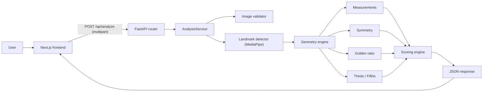

# Faceometry

### The Geometry Behind Your Face

**Analyze facial proportions, symmetry, and classical geometric ratios using computer vision and mathematics.**

Faceometry is a full-stack web application. You upload a front-facing photo. The backend detects 478 facial landmarks with MediaPipe, measures the face geometrically, and returns a **Facial Harmony Score** with a detailed breakdown and plain-language explanations.

> [!IMPORTANT]
> Faceometry is a **geometric analysis tool**. It does **not** claim to objectively measure beauty or attractiveness. Scores describe how closely a face matches a set of classical proportion references. Those references are configurable and are not scientifically validated as ideals.

---

## Table of Contents

- [Features](#features)
- [Tech Stack](#tech-stack)
- [Architecture](#architecture)
- [Project Structure](#project-structure)
- [Getting Started](#getting-started)
- [Configuration](#configuration)
- [API Reference](#api-reference)
- [How Scoring Works](#how-scoring-works)
- [Image Requirements](#image-requirements)
- [Testing](#testing)
- [Docker](#docker)
- [Deployment](#deployment)
- [Privacy](#privacy)
- [Limitations](#limitations)
- [Roadmap](#roadmap)
- [License](#license)

---

## Features

- **Landmark detection**: 478-point face mesh via MediaPipe Face Landmarker.
- **Image validation**: checks face count, face size, blur, lighting, and head pose (yaw, pitch, roll) before analysis.
- **Symmetry analysis**: compares mirrored landmark pairs per region (eyes, brows, nose, mouth, jaw) against the facial midline.
- **Golden ratio analysis**: compares a configurable list of facial ratios to φ ≈ 1.618.
- **Facial thirds and fifths**: measures vertical and horizontal proportions against reference distributions.
- **Weighted Facial Harmony Score** (0–100) with a per-component breakdown.
- **Explanations** in plain language for every score component.
- **Annotated landmark overlay** returned as a base64 image.
- **Responsive, animated UI** with an aurora background, stepped loading states, count-up scores, and animated bar charts.
- **Privacy-first**: images are processed in memory and never stored.

---

## Tech Stack

| Layer | Technology |
|-------|-----------|
| **Frontend** | Next.js 16 (App Router), React 19, TypeScript, Tailwind CSS v4 |
| **Backend** | Python, FastAPI, Pydantic v2, pydantic-settings |
| **Computer Vision** | MediaPipe Face Landmarker, OpenCV (headless), Pillow |
| **Math** | NumPy, custom geometry engine |
| **Testing** | pytest, httpx |
| **Deployment** | Docker, Vercel (frontend), Render/Railway (backend) |

---

## Architecture



Pipeline for each request:

1. The router validates file extension, content type, and size.
2. `AnalysisService` decodes the image and runs quality and pose validation.
3. MediaPipe extracts landmarks.
4. The geometry engine computes measurements, symmetry, ratios, thirds, and fifths.
5. The scoring engine combines the components into the harmony score and generates explanations.
6. The response is returned and the image bytes are discarded.

The frontend stores the result in `sessionStorage` to pass it from `/analyze` to `/results`.

More detail is in [`docs/architecture.md`](docs/architecture.md), [`docs/methodology.md`](docs/methodology.md), and [`docs/api.md`](docs/api.md).

---

## Project Structure

```
Faceometry/
├── frontend/                 # Next.js + TypeScript + Tailwind v4
│   ├── app/
│   │   ├── page.tsx          # Landing page
│   │   ├── analyze/page.tsx  # Upload + analysis progress
│   │   ├── results/page.tsx  # Score dashboard
│   │   ├── layout.tsx
│   │   └── globals.css       # Design system (layered styles, animations)
│   ├── components/ui.tsx     # Shared UI (Aurora, Nav, Reveal, etc.)
│   └── lib/api.ts            # Typed API client
├── backend/
│   ├── app/
│   │   ├── main.py           # FastAPI entry point
│   │   ├── config.py         # All thresholds, weights, limits
│   │   ├── api/              # Route handlers
│   │   ├── cv/               # Landmark detector, validator, visualizer, model file
│   │   ├── geometry/         # measurements, symmetry, golden_ratio, thirds, fifths
│   │   ├── scoring/          # Harmony score engine
│   │   ├── models/           # Pydantic request/response schemas
│   │   └── services/         # Pipeline orchestration
│   ├── scripts/              # CLI tools (e.g. test_landmarks.py)
│   ├── tests/                # Unit and integration tests
│   ├── Dockerfile
│   └── requirements.txt
├── ml/                       # ML experiments (post-V1)
├── docs/                     # architecture, methodology, api
└── docker-compose.yml
```

---

## Getting Started

### Prerequisites

- Python 3.10+ (the Docker image uses 3.11)
- Node.js 20+ and npm
- Git

### 1. Clone

```bash
git clone https://github.com/parvatkhattak/Faceometry.git
cd Faceometry
```

### 2. Backend

```bash
cd backend
python -m venv venv
source venv/bin/activate        # Windows: venv\Scripts\activate
pip install -r requirements.txt
uvicorn app.main:app --reload --port 8000
```

- API: http://localhost:8000
- Interactive docs (Swagger): http://localhost:8000/docs
- Health check: http://localhost:8000/health

### 3. Frontend

```bash
cd frontend
npm install
echo "NEXT_PUBLIC_API_URL=http://localhost:8000" > .env.local
npm run dev
```

Open http://localhost:3000.

### 4. Try the CLI

Run landmark detection on an image without the UI:

```bash
cd backend
python scripts/test_landmarks.py path/to/photo.jpg
```

---

## Configuration

All tunables live in [`backend/app/config.py`](backend/app/config.py) and can be overridden with environment variables. Each settings group has its own prefix.

### General

| Variable | Default | Description |
|----------|---------|-------------|
| `FACEOMETRY_DEBUG` | `false` | Include technical error detail in 500 responses |
| `FACEOMETRY_CORS_ORIGINS` | `["http://localhost:3000","http://localhost:3001"]` | Allowed CORS origins (JSON list) |

### Image validation (`FACEOMETRY_VALIDATION_*`)

| Setting | Default | Description |
|---------|---------|-------------|
| `min_face_fraction` | `0.04` | Minimum fraction of the image the face must occupy |
| `blur_threshold` | `30.0` | Minimum Laplacian variance (lower means blurrier) |
| `min_brightness` / `max_brightness` | `40` / `220` | Allowed mean brightness (0–255) |
| `max_yaw` / `max_pitch` / `max_roll` | `30°` / `25°` / `35°` | Maximum head rotation (auto-aligned for tilt) |
| `max_file_size_mb` | `10` | Upload size limit |
| `allowed_extensions` | `.jpg .jpeg .png .webp` | Accepted formats |

### Scoring weights (`FACEOMETRY_SCORING_*`)

| Setting | Default |
|---------|---------|
| `weight_symmetry` | `0.35` |
| `weight_proportion` | `0.25` |
| `weight_golden_ratio` | `0.20` |
| `weight_facial_thirds` | `0.10` |
| `weight_facial_fifths` | `0.10` |

The weights are **experimental** and are not claimed to be optimal.

### Frontend

| Variable | Description |
|----------|-------------|
| `NEXT_PUBLIC_API_URL` | Base URL of the backend (for example `http://localhost:8000`) |

---

## API Reference

### `GET /health`

```json
{ "status": "healthy" }
```

### `POST /api/analyze`

Upload a photo as `multipart/form-data` with the field name `image`.

```bash
curl -X POST http://localhost:8000/api/analyze \
  -F "image=@photo.jpg"
```

**Success (200)**: abbreviated

```json
{
  "success": true,
  "face": { "count": 1, "pose": { "yaw": 1.2, "pitch": -3.4, "roll": 0.8 } },
  "scores": {
    "symmetry": 88.1,
    "proportion": 79.4,
    "golden_ratio": 72.3,
    "facial_thirds": 84.0,
    "facial_fifths": 81.5,
    "harmony": 82.0
  },
  "measurements": { "face_width": 0.0, "face_height": 0.0, "...": "..." },
  "golden_ratio_analysis": { "ratios": [], "overall_score": 72.3 },
  "symmetry_analysis": { "overall_score": 88.1, "details": [] },
  "facial_thirds": { "upper_third": 0.33, "middle_third": 0.33, "lower_third": 0.34, "score": 84.0 },
  "facial_fifths": { "sections": [0.2, 0.2, 0.2, 0.2, 0.2], "score": 81.5 },
  "explanations": [{ "component": "symmetry", "score": 88.1, "explanation": "..." }],
  "landmark_image_base64": "..."
}
```

**Errors**

| Status | Meaning | Body |
|--------|---------|------|
| `400` | Unsupported file type or unreadable file | `{ success: false, error }` |
| `413` | File larger than the limit | `{ success: false, error }` |
| `422` | Image failed validation (no face, multiple faces, blur, lighting, pose) | `{ success: false, error, issues: [...] }` |
| `500` | Unexpected server error | `{ success: false, error, detail? }` |

The full schema is in [`backend/app/models/schemas.py`](backend/app/models/schemas.py) and in the Swagger UI at `/docs`.

---

## How Scoring Works

The **Facial Harmony Score** is a weighted average of five component scores, each from 0 to 100:

```
harmony = 0.35·symmetry + 0.25·proportion + 0.20·golden_ratio
        + 0.10·thirds   + 0.10·fifths
```

| Component | What it measures |
|-----------|------------------|
| **Symmetry** | Distance between mirrored landmark pairs after reflection across the facial midline, normalized by face size, per region |
| **Proportion** | Agreement of general measurements (eye, nose, mouth, face aspect ratios) with common reference ranges |
| **Golden ratio** | Relative deviation of selected ratios from φ. Only the ratios listed in `GoldenRatioSettings.analyzed_ratios` are compared. |
| **Facial thirds** | Hairline→brow, brow→nose base, and nose base→chin against equal thirds |
| **Facial fifths** | Five horizontal sections across the face width against equal fifths |

All measurements are normalized by face size, so the result does not depend on image resolution or distance from the camera. See [`docs/methodology.md`](docs/methodology.md) for the math.

---

## Image Requirements

For best results, use a photo that:

- shows **exactly one** face, looking towards the camera
- has the head rotated within ±30° yaw, ±25° pitch, and ±35° roll (head tilts are automatically rectified)
- is sharp, evenly lit, and not over- or under-exposed
- shows the face clearly, filling at least 4% of the frame
- is JPEG, PNG, or WebP and under 10 MB

---

## Testing

```bash
cd backend
source venv/bin/activate
pytest -v
```

The suite has 61 tests covering measurements, symmetry, golden ratio, thirds and fifths, pose validation/alignment, scoring, and the API.

Frontend checks:

```bash
cd frontend
npm run lint
npm run build
```

---

## Docker

Build and run the backend:

```bash
docker compose up --build
```

The backend is served at http://localhost:8000. It includes a health check that calls `/health`. The frontend is run separately with `npm run dev`, or deployed to Vercel.

---

## Deployment

| Part | Suggested host | Notes |
|------|----------------|-------|
| Frontend | Vercel | Set `NEXT_PUBLIC_API_URL` to the public backend URL |
| Backend | Render / Railway / any Docker host | Use `backend/Dockerfile`. Set `FACEOMETRY_CORS_ORIGINS` to your frontend origin. |

---

## Privacy

- Uploaded images are processed in memory and discarded right after analysis.
- No facial images are stored by default.
- No images are used for model training without explicit consent.

---

## Limitations

- Results depend on photo quality, lens distortion, expression, and pose, even within the allowed limits.
- Classical proportions such as φ, thirds, and fifths are cultural and historical references. They are **not** universal standards of beauty.
- The score is a geometric measure. It says nothing about a person's attractiveness, health, or worth.
- Only single, near-frontal faces are supported.

---

## Roadmap

- [x] Backend geometry, scoring, and validation pipeline
- [x] REST API and test suite
- [x] Responsive, animated frontend
- [ ] Multi-stage Dockerfile and production hardening
- [ ] Frontend service in `docker-compose.yml`
- [ ] ML experiments (`ml/`): learned symmetry and proportion models

---

## License

MIT
